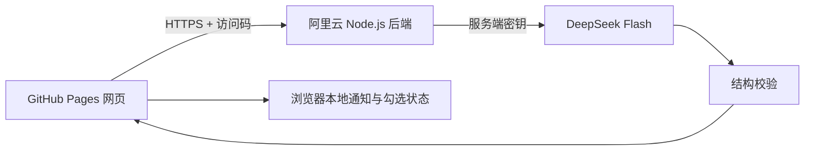

# 校园 Inbox

将校园通知整理成清晰、可以逐项勾选的任务清单。

**网站：** https://kemou2333.github.io/campus-inbox/


## 功能

- 从文字通知提取简短任务、责任对象、执行细节、时间和地点。
- 重点展示任务，背景、材料、提醒和原文按需展开。
- 逐项勾选、通知完成状态、截止时间排序、删除和 JSON 备份恢复。
- 兼容旧版备份；没有明确行动的信息通知不生成虚构任务。
- 拟态阴影和磨砂透明界面，适配桌面与手机。
- DeepSeek 结构化 JSON 输出，并在服务端严格校验。

## 架构



网页使用原生 HTML、CSS、JavaScript，后端使用 Node.js 内置 HTTP 与 fetch。业务代码不依赖前端框架，也不建立通知数据库。

API Key 留在服务器环境文件中，网页只保存短期访问码。相同文字的有效结果在服务器内存中最多缓存 15 分钟，缓存不会写入磁盘。磁盘只保存每日请求数和 token 计数，服务重启后仍保留当日限额。

## 成本与访问控制

- 模型为 `deepseek-flash`，显式关闭思考模式。
- 每次最多生成 3,000 个输出 token，不自动重试付费请求。
- 默认全站每天最多 30 次模型请求，每个来源 IP 每分钟最多 5 次整理请求。
- Bearer 访问码校验、明确的网页来源列表、输入和输出大小限制。
- API Key、SSH 私钥、服务器密码和访问码不进入公开仓库。
- GitHub Actions 使用仅允许发布本应用的 SSH 密钥，不使用 root 密码。

## 项目结构

| 路径 | 内容 |
| --- | --- |
| `dist/` | 网页、样式、浏览器存储与共享数据校验 |
| `server/` | 阿里云后端、服务管理、反向代理与发布脚本 |
| `worker/prompt.mjs` | AI 系统提示词 |
| `docs/AI-CONTRACT.md` | 结构化输出约定 |
| `docs/analysis.schema.json` | 输出结构定义 |
| `.github/workflows/` | 网页和后端自动部署 |
| `tests/` | 鉴权、费用限额、缓存和输出校验测试 |

## 验证

```sh
node --test tests/backend.test.mjs
```

测试包含：未经授权的请求不会调用模型；缓存不会重复付费；每日限额跨重启保留；思考模式关闭；错误结构和截断输出被拒绝。

## 部署

见 [部署说明](docs/DEPLOYMENT.md)。GitHub Pages 负责网页，阿里云负责模型调用，无需 Cloudflare 账号。

公开仓库方便技术展示，原始通知和个人完成记录不会随代码发布。换网址或浏览器前，请从原网页导出备份，再在新网页恢复。
