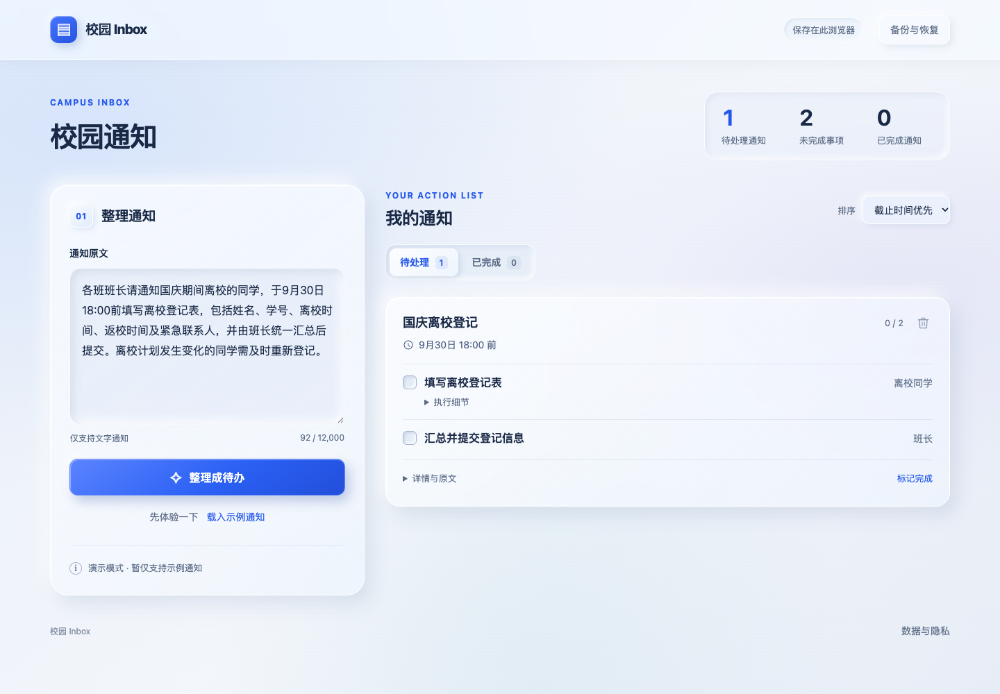
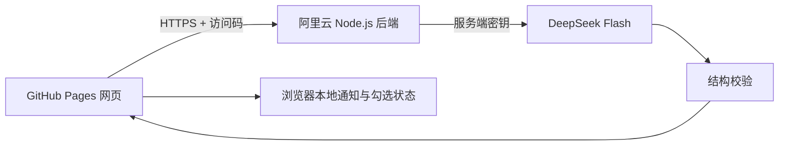

# 校园 Inbox

将校园通知整理成清晰的待办与提醒。

**网站：** https://kemou2333.github.io/campus-inbox/



## 功能

- 从文字通知提取简短任务、责任对象、适用条件、时间和地点，先显示谁需要做。
- 每次输入最多 4,000 字，显示实时字数；旧备份仍可恢复。
- 首次打开显示三步使用指南，右上角 ? 可随时重看。
- 一次粘贴多个主题，拆成独立通知；纪律、安全与纯信息放在提醒栏。
- 通知、事项、子步骤三层清单；同一责任人流程可拆子步骤，也可手动添加、编辑、删除，勾完自动完成父事项。办理方式、背景、材料和原文按需展开。
- 图片、PDF 与文本附件可原地预览，其它文件可下载；附件不上传模型。
- 每项待办、提醒要点与子步骤都可独立写笔记，旧通知备注也会保留；通知、笔记、完成状态和附件一起备份。
- 逐项勾选或标记不适用，全部处理后自动移到已完成；完成、删除与恢复可撤销。
- 触屏横向滑动可完成通知，纵向滚动与按钮操作不触发滑动。
- 兼容旧版备份；没有明确行动的信息通知不生成虚构任务。
- 拟态阴影与磨砂透明界面，提供自托管的圆润字体及思源黑体两版，适配手机并支持减少动效偏好。
- 通知与笔记本地搜索、文字草稿自动保存、重复原文提交提醒。
- 用本机时间区分已截止、24小时内与3天内，可为事项补个人截止；缺少年份或具体时间时保留原文，不猜日期。
- 办理方式支持安全行内粗体、代码、链接，原文时间自动突出显示。
- 多主题同时带附件时逐份选择所属通知，避免混挂；附件不进入模型请求。
- DeepSeek 结构化 JSON 输出，并在服务端严格校验。
- 点击“示例”查看4条已保存的模型结果，覆盖全体任务、条件任务、多人分工与安全提醒；不调用模型。示例明确标注，可独立移除并撤销。

## 架构



网页使用原生 HTML、CSS、JavaScript，后端使用 Node.js 内置 HTTP 与 fetch。业务代码不依赖前端框架，也不建立通知数据库。

API Key 留在服务器环境文件中，网页只保存短期访问码。相同文字的有效结果在服务器内存中最多缓存 15 分钟，缓存不会写入磁盘。磁盘只保存每日请求数和 token 计数，服务重启后仍保留当日限额。

字体对比：[圆润版](https://kemou2333.github.io/campus-inbox/?font=rounded) · [思源黑体版](https://kemou2333.github.io/campus-inbox/?font=square)。也可以点页面左上角图标切换。字体来源及许可见 `dist/assets/fonts/README.md`。

## 成本与访问控制

- 模型为 `deepseek-flash`，启用最低 `low` 思考强度。
- 每次最多生成 6,000 个 token（包含思考和最终输出），不自动重试付费请求。
- 多条通知合并成一次模型请求，重复的系统提示词只发送一次。
- 默认全站每天最多 30 次模型请求，每个来源 IP 在滚动 3 分钟内最多 5 次整理请求；达到限额显示等待时间，页面不会自动重试。
- Bearer 访问码校验、明确的网页来源列表、输入和输出大小限制。
- API Key、SSH 私钥、服务器密码和访问码不进入公开仓库。
- GitHub Actions 使用仅允许发布本应用的 SSH 密钥，不使用 root 密码。

## 项目结构

| 路径 | 内容 |
| --- | --- |
| `dist/` | 网页、样式、浏览器存储与共享数据校验 |
| `server/` | 阿里云后端、服务管理、反向代理与发布脚本 |
| `worker/prompt.mjs` | AI 系统提示词 |
| `docs/AI-CONTRACT.md` | 结构化输出约定 |
| `docs/analysis.schema.json` | 输出结构定义 |
| `.github/workflows/` | 网页和后端自动部署 |
| `tests/` | 鉴权、费用限额、缓存和输出校验测试 |

## 验证

```sh
node --test tests/*.test.mjs
```

测试包含：完整原文时间校验与 24:00 换算；未经授权的请求不会调用模型；缓存不会重复付费；每日限额跨重启保留；低强度思考与生成上限；错误结构和截断输出被拒绝。

2026-10-03 用下载办事簿中的四条原文做过一次普通界面批量提交：一个请求得到四条通知，未重试、未人工改写内容。用户随后授权在正式网页提供示例，经过筛选的4条普通通知结果保存在 `dist/examples.json`，不含个人名单、联系方式、笔记或附件。完整测试记录与个人备份留在本机。验证范围见 [VERIFICATION.md](docs/VERIFICATION.md)。

## 部署

见 [部署说明](docs/DEPLOYMENT.md)。GitHub Pages 负责网页，阿里云负责模型调用，无需 Cloudflare 账号。

公开仓库方便技术展示，个人通知、笔记和完成记录不会随代码发布；示例包为经筛选的普通通知。换网址或浏览器前，请从原网页导出备份，再在新网页恢复。

更多免费检查与视觉参考见 [FREE-CHECKS.md](docs/FREE-CHECKS.md)。
