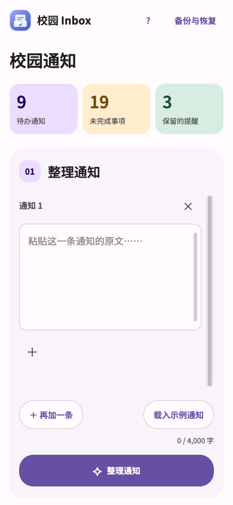
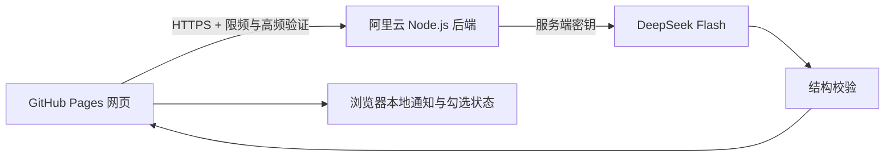

# 校园 Inbox

将校园通知整理成清晰的待办与提醒。

**网站：** https://kemou2333.github.io/campus-inbox/


## 功能

- 从文字通知提取简短任务、责任对象、适用条件、时间和地点，先显示谁需要做。
- 每次输入最多 4,000 字，显示实时字数；旧备份仍可恢复。
- 首次打开显示三步使用指南，右上角 ? 可随时重看。
- 点击“再加一条”逐条粘贴通知，各条原文和附件独立对应，整批只调用一次模型；纪律、安全与纯信息放在提醒栏。
- 通知、事项、AI生成的子步骤三层清单；原文中的连续办理流程由模型拆出，步骤、必要字段和原文模板直接展示。勾完自动完成父事项，笔记按每项保存。背景、材料和原文按需展开。
- 图片、PDF 与文本附件可原地预览，其它文件可下载；附件不上传模型。
- 每项待办、提醒要点与子步骤都可独立写笔记，旧通知备注也会保留；通知、笔记、完成状态和附件一起备份。
- 逐项勾选或标记不适用，全部处理后自动移到已完成；完成、删除与恢复可撤销。
- 触屏横向滑动可完成通知，纵向滚动与按钮操作不触发滑动。
- 兼容旧版备份；没有明确行动的信息通知不生成虚构任务。
- 拟态阴影与磨砂透明界面，提供自托管的圆润字体及思源黑体两版，适配手机并支持减少动效偏好。
- 通知与笔记本地搜索、文字草稿自动保存、重复原文提交提醒。
- 用本机时间区分已截止、24小时内与3天内，可为事项补个人截止；缺少年份或具体时间时保留原文，不猜日期。
- 办理方式支持安全行内粗体、代码、链接，原文时间自动突出显示。
- 每个输入模块独立添加附件，避免混挂；附件不进入模型请求。
- DeepSeek 结构化 JSON 输出，并在服务端严格校验。时间新增年月日时分结构，缺年份和相对时间保留原文；完整日期无钟点可作为全天日历候选。
- 信息通知的后续处理安排直接呈现，保留AI原字段内容。
- 本地紧急事项区显示今天、即将截止与逾期记录，可跳到对应通知；不从不完整日期猜年份。
- 导出标准ICS日历文件，在手机或电脑日历中确认加入；没有完整日期时由用户确认时间。
- 固定输入视口、可拖动的持续滚动轨道，以及跟手切换待办/提醒/已完成的滑块。
- 点击“载入示例通知”追加12条已保存的DeepSeek结果；与真实通知使用同一个列表，可以继续整理、勾选、记笔记和备份。重复载入不会覆盖进度，也不调用模型。

## Android 安装版

[下载 APK 1.0.0](https://github.com/Kemou2333/campus-inbox/releases/download/android-v1.0.0/campus-inbox-1.0.0.apk) · [发布记录](https://github.com/Kemou2333/campus-inbox/releases/tag/android-v1.0.0)

安卓版使用 Material You 扁平色块、浅色/深色及 Android 12+ 系统动态配色，保留同一套通知与清单功能。内置页面支持离线查看本地记录，新增 AI 整理需要联网。支持系统分享文字、选择和保存附件及备份、打开系统日历确认添加。通知保存在应用本地，与浏览器各自独立，可通过备份迁移。

Android 8.0 及以上可安装，安装包约12.4 MB。已完成签名构建及基础检查，尚未进行真实手机安装与系统应用联动测试。后续覆盖升级要保留签名并提高版本号；签名私钥仅放在本机私密配置和 GitHub 加密 Secrets 中。构建与桥接口说明见 [Android README](mobile/android/README.md)。



## 架构



网页使用原生 HTML、CSS、JavaScript，后端使用 Node.js 内置 HTTP 与 fetch。业务代码不依赖前端框架，也不建立通知数据库。

API Key 留在服务器环境文件中，网页不需要访问码。相同文字的有效结果在服务器内存中最多缓存15分钟，缓存不写入磁盘。磁盘仅保存每日用量、固定错误代码和使用每日HMAC标识的IP计数/时间戳；不保存通知正文、原始IP或模型结果，重启后仍保留当日额度与滚动限频。

字体对比：[圆润版](https://kemou2333.github.io/campus-inbox/?font=rounded) · [思源黑体版](https://kemou2333.github.io/campus-inbox/?font=square)。也可以点页面左上角图标切换。字体来源及许可见 `dist/assets/fonts/README.md`。

## 成本与访问控制

- 模型为 `deepseek-flash`，当前使用直接整理与JSON模式。实际low思考试验耗尽上限仍无最终答案，因此已停止试验；low没有独立token硬预算。见 [DeepSeek 官方说明](https://api-docs.deepseek.com/guides/thinking_mode/)。
- 每次最多生成 8,192 个 token，当前全部用于最终输出，不自动重试付费请求。
- 单条或多条模块统一发送明确来源数组，一批共用一次系统提示词和一次模型请求；最多20条、原文合计4,000字，超限在调用前拒绝。旧接口保留整行`---`分隔兼容。
- 默认全站每日最多30次付费模型调用，每个IP每日最多10次，滚动3分钟最多5次整理提交；失败的付费调用也计入额度。达到上限显示等待时间，不自动重试模型。
- 连续提交的第3次起，未命中缓存时触发免费的自动轻量计算验证；签名绑定来源、IP与本次正文，两分钟有效且只能使用一次。验证本身不调用模型，完成后最多一次付费请求。另有限定来源、输入输出大小限制和全站单并发。
- API Key、SSH私钥、服务器密码和验证签名密钥不进入公开仓库。自动验证用于抬高刷接口成本，不声称能识别人类；Origin也不能阻止脚本伪造来源。最终费用防线是服务端持久化限额。
- GitHub Actions 使用仅允许发布本应用的 SSH 密钥，不使用 root 密码。

## 项目结构

| 路径 | 内容 |
| --- | --- |
| `dist/` | 网页、样式、浏览器存储与共享数据校验 |
| `server/` | 阿里云后端、服务管理、反向代理与发布脚本 |
| `worker/prompt.mjs` | AI 系统提示词 |
| `docs/AI-CONTRACT.md` | 结构化输出约定 |
| `docs/analysis.schema.json` | 输出结构定义 |
| `mobile/` | Android 容器、Material You 主题与离线打包 |
| `.github/workflows/` | 网页和后端自动部署、签名 APK 构建 |
| `tests/` | 鉴权、费用限额、缓存和输出校验测试 |

示例入口：[载入示例通知](https://kemou2333.github.io/campus-inbox/?examples=1)。只追加已有结果，保留个人记录与输入草稿；旧?demo=1链接同样兼容，载入后移除参数以免刷新重复操作。

## 验证

```sh
node --test tests/*.test.mjs
```

测试包含：完整原文时间校验与 24:00 换算；来源、验证或额度不合格的请求不会调用模型；缓存不会重复付费；每日限额跨重启保留；显式关闭思考与生成上限；错误结构和截断输出被拒绝，已消耗token仍准确计量。

2026-10-03 用下载办事簿中的四条原文做过一次普通界面批量提交：一个请求得到四条通知，未重试、未人工改写内容。用户随后授权在正式网页提供示例，经过筛选的12条历史结果保存在 `dist/examples.json`，不含个人名单、联系方式、笔记或附件。完整测试记录与个人备份留在本机。2026-10-04 当前提示词再以4个输入模块一次实际调用验收，返回4张卡，角色、流程及例外条件主要通过；结果没有人工改写。历史开发版本做过不同配置测试，不将它们描述为从未重跑。验证范围及局限见 [VERIFICATION.md](docs/VERIFICATION.md)。

## 部署

见 [部署说明](docs/DEPLOYMENT.md)。GitHub Pages 负责网页，阿里云负责模型调用，无需 Cloudflare 账号。

公开仓库方便技术展示，个人通知、笔记和完成记录不会随代码发布；示例包为经筛选的普通通知。换网址或浏览器前，请从原网页导出备份，再在新网页恢复。

更多免费检查与视觉参考见 [FREE-CHECKS.md](docs/FREE-CHECKS.md)。
